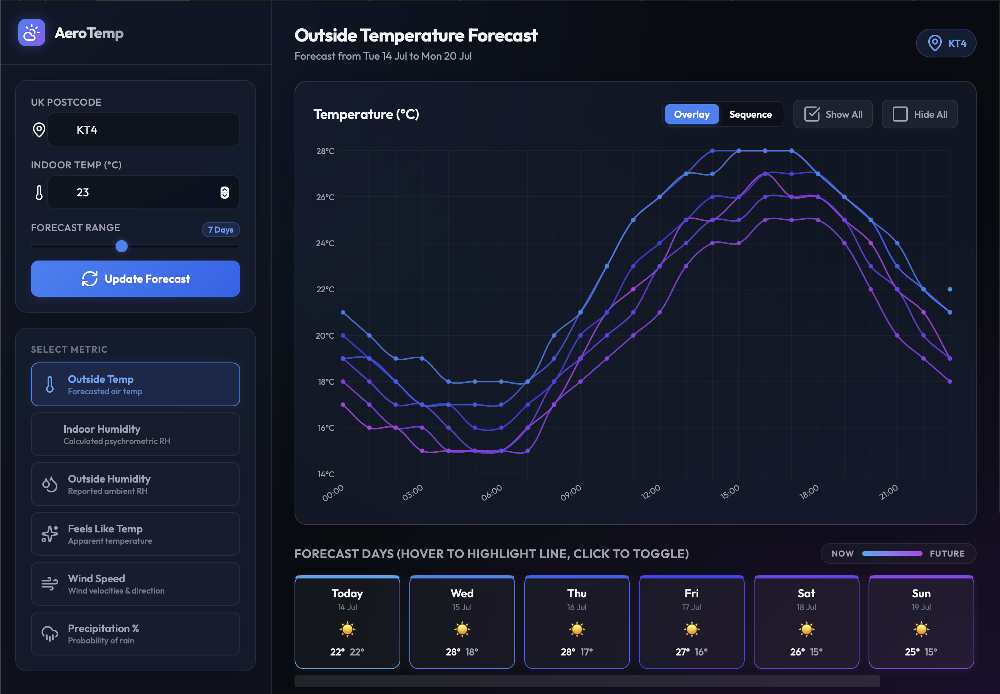

# AeroTemp Weather Dashboard

A premium, interactive weather and humidity trend visualization dashboard built using HTML, Vanilla CSS, and modern JavaScript. It fetches live, detailed weather data from the BBC Weather Aggregated API for any UK postcode.

🌐 **[View live demo →](https://www.richard-stanton.com/weather-dashboard/)**



## Features

- **Postcode & Indoor Temp Filtering:** Fetches live weather data for any UK postcode (e.g. `KT4`, `SW1A`) and calculates indoor relative humidity on the fly.
- **Forecast Range Slider:** Limit the chart to the next 1–14 days with a live-updating range slider (defaults to 7 days).
- **Overlay & Sequence Modes:** Toggle between overlaying each day on a 24-hour grid (for comparison) or viewing all days as a continuous chronological timeline with a gradient colour sweep.
- **Advanced Metric Selector:** Toggle between:
  - Outside Temperature
  - Indoor Humidity (calculated via vapour pressure saturation formulas)
  - Outside Relative Humidity
  - Feels Like Temp
  - Wind Speed
  - Precipitation Probability
- **Dynamic Day Tiles:** The min/max values shown on each day card update to reflect the currently selected metric.
- **Consistent Colour Legend:** Days are coloured on a unified Sky Blue (now) → Purple (future) timeline scale across all metrics, with a "Now → Future" legend.
- **High-Fidelity Tooltip & Highlight Effects:** Hover over day summary cards to highlight that day's line on the chart. Toggle lines on/off by clicking cards. Custom tooltips show multi-dimensional comparisons.
- **Smart Insights Panel:** Dynamically calculates maximum temperature peaks, maximum indoor RH peaks, maximum wind speeds, and assesses damp/mold risks based on sustained high indoor humidity.
- **URL State Persistence:** Postcode, indoor temp, forecast range, and chart mode are all synced to URL parameters for easy sharing/bookmarking.

## Indoor Humidity Calculation

Indoor Relative Humidity ($RH_{in}$) is calculated using the Magnus-Tetens psychrometric formula to determine the saturation vapor pressure ($p_{sat}$) at a given temperature:

$$p_{sat}(T) = 6.122 \times \exp\left(\frac{17.62 \times T}{243.12 + T}\right)$$

Assuming the moisture level inside is close to outside, the inside humidity is computed as:

$$RH_{in} = \frac{(T_{in} + 273.15) \times RH_{out} \times p_{sat}(T_{out})}{(T_{out} + 273.15) \times p_{sat}(T_{in})}$$

## How to Run Locally

1. Clone or navigate to the directory:
   ```bash
   cd weather-dashboard
   ```
2. Start the local development server:
   ```bash
   npm run dev
   ```
3. Open `http://localhost:8080` in your web browser. Or pass URL parameters directly:
   `http://localhost:8080/?postCode=KT4&indoorTemp=23`
